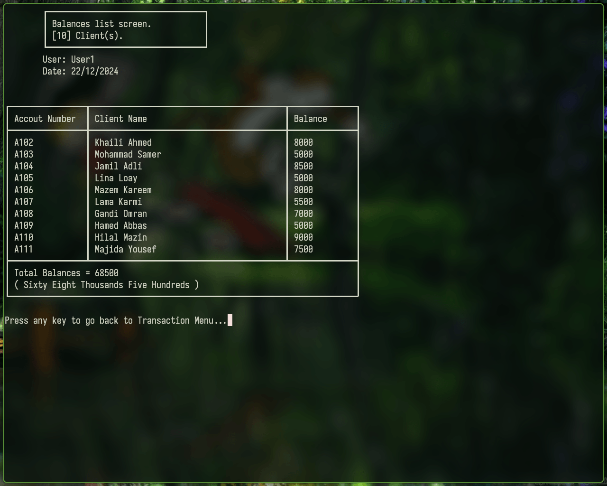

# Bank Management System

<<<<<<< HEAD

Terminal C++ program, let users manage a bank system with clients.

> [!NOTE]
> Tested in Linux only.
=======

Terminal C++ program, let users manage a bank system with clients.

NOTE: Tested on Linux only.
>>>>>>> 4deaccb927fc415a659bfbf5de089c91e5a4ae97

---
## How to use
1. Clone this repo.
2. Build the project by running `Make.sh` file.
3. Run the program, use `.\outDebug`.

<<<<<<< HEAD
> [!NOTE]
> This project use Clang as a compiler.

---
## Files structure
=======
---
## Files
>>>>>>> 4deaccb927fc415a659bfbf5de089c91e5a4ae97
1. Main file is `test.cpp`.
2. `Clients.txt`: Stores clients data.
3. `Currencies.txt`: Stores countries currency data.
4. `LoginRegister.txt`: Stores successful logins to the system along with a time stamp.
5. `Users.txt`: Stores system users data along with there system permissions and password, increpted with simple cypher.
6. `TransferLog.txt`: Stores successful client account transaction, along with a time stamp, and the user who made it.

---
